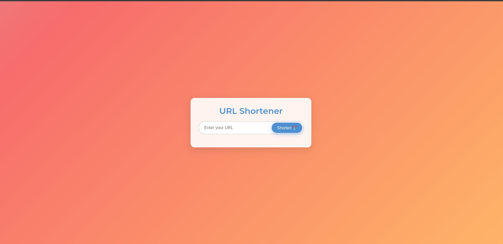

Here is your updated `README.md` with the contributing section included:

# URL Shortener

A web-based application that allows users to shorten URLs and redirect to the original URL by visiting the shortened link. Built with Node.js, Express, MongoDB, and a clean user interface using EJS and custom CSS.

---

## Features

- **URL Shortening**: Input a URL to generate a shorter version of it.
- **Redirection**: Redirect users to the original URL by visiting the shortened URL.
- **Responsive UI**: Clean, minimal design that adapts to all screen sizes.
- **MongoDB Integration**: Stores original and shortened URLs in a MongoDB database.
- **Animations**: Smooth transitions and animations using GSAP.
- **Particles.js**: Background particle effects for a dynamic look.

---

## Demo



---

## Installation

1. Clone the repository:
   ```bash
   git clone https://github.com/SpectraX07/url-shortener.git
   ```

2. Navigate to the project directory:
   ```bash
   cd url-shortener
   ```

3. Install dependencies:
   ```bash
   npm install
   ```

4. Create a `.env` file in the root directory with your MongoDB URI:
   ```
   MONGO_URI=your_mongo_connection_string
   PORT=3000
   ```

5. Start the application:
   ```bash
   npm start
   ```

6. Open the application in your browser:
   ```
   http://localhost:3000
   ```

---

## API Endpoints

- **POST /api/shorten**: Shortens a URL. Accepts a JSON body with the `originalUrl` field.
  - Example Request:
    ```json
    {
      "originalUrl": "https://example.com"
    }
    ```

- **GET /api/:shortUrl**: Redirects to the original URL for the given short URL.

---

## Usage

1. Enter your URL in the input field.
2. Click the **Shorten** button.
3. View the shortened URL in the output container.
4. Use the **Copy** button to copy the shortened URL to your clipboard.

---

## Technologies Used

- **Node.js**: Backend server for handling URL shortening and redirection.
- **Express**: Web framework for routing and handling HTTP requests.
- **MongoDB**: Database for storing URLs.
- **EJS**: Templating engine for rendering dynamic content on the web.
- **GSAP**: Library for animations and transitions on the frontend.
- **Particles.js**: Background particle animation library.
- **Shortid**: Library for generating unique shortened URLs.

---

## Customization

You can customize the color theme and UI by modifying the CSS variables in the `style.css` file:

```css
:root {
    --primary-color: #4C90D1;
    --secondary-color: #45B69D;
    --tertiary-color: #FFC857;
    --background-color: linear-gradient(135deg, #A8D0E6, #F76C6C, #FFBC67, #A8E6CF);
    --input-bg: #FFFFFF;
    --card-bg: rgba(255, 255, 255, 0.9);
    --text-color: #333;
    --glow-color: rgba(72, 161, 222, 0.6);
}
```

---

## Known Issues

- Ensure the MongoDB connection is correctly configured in the `.env` file.
- CORS might need to be configured if deploying the app with separate frontend and backend.

---

## Contributing

We welcome contributions to improve the project! If you'd like to contribute, follow these steps:

1. Fork the repository.
2. Create a new branch for your feature:
   ```bash
   git checkout -b feature-branch
   ```
3. Make your changes and commit them:
   ```bash
   git commit -m "Add your message here"
   ```
4. Push to your branch:
   ```bash
   git push origin feature-branch
   ```
5. Open a pull request with a description of your changes.

---

## License

This project is licensed under the MIT License. See the [LICENSE](LICENSE) file for details.

---

## Acknowledgments

- [GSAP](https://greensock.com/gsap/) for animations.
- [MongoDB](https://www.mongodb.com/) for database integration.

---

## Contact

If you have any questions or suggestions, feel free to reach out:

- **Email**: spectraxcodes07@gmail.com
- **GitHub**: [SpectraX07](https://github.com/SpectraX07)
```